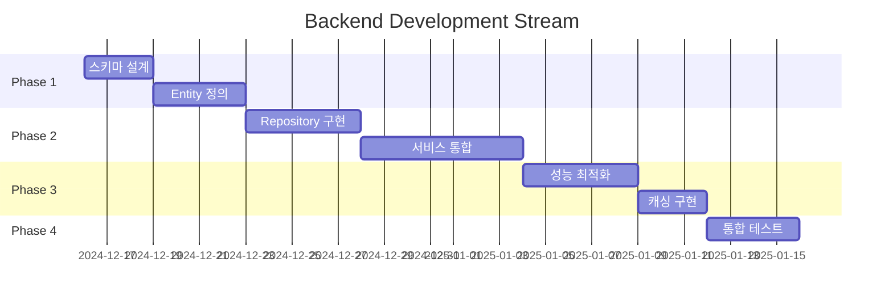
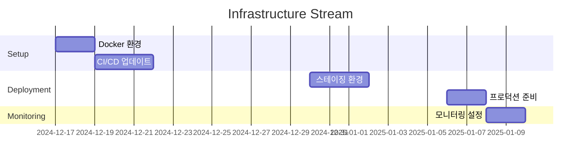
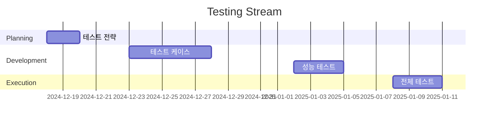

# 🗃️ DATABASE-INTEGRATION 프로젝트 - 태스크 관리 시스템

## 📋 프로젝트 개요

### Epic: DATABASE-INTEGRATION 
**Epic ID**: `EPIC-DB-001`  
**우선순위**: 높음 | **복잡도**: 높음 | **ROI**: 높음  
**전략**: Systematic | **예상 기간**: 8주 | **상태**: 진행중

**목표**: NestJS Saga Pattern 프로젝트의 인메모리 저장소를 PostgreSQL + TypeORM 기반의 프로덕션 준비된 데이터베이스 시스템으로 전환

### 비즈니스 가치
- ✅ **프로덕션 준비성**: 실제 서비스 배포 가능한 영구 저장소
- ✅ **데이터 무결성**: ACID 트랜잭션으로 데이터 일관성 보장
- ✅ **확장성**: 대용량 트래픽 처리 가능한 성능 기반 구축
- ✅ **운영 안정성**: 백업, 복구, 모니터링 체계 구축

## 🏗️ 계층적 태스크 구조

### 📊 Epic → Stories → Tasks → Subtasks 구조

```
EPIC-DB-001: Database Integration
├── STORY-DB-001: 기초 설계 (Week 1-2)
│   ├── TASK-DB-001-A: 데이터베이스 스키마 설계
│   │   ├── SUBTASK: ERD 다이어그램 작성
│   │   ├── SUBTASK: 테이블 정의 및 관계 설정
│   │   └── SUBTASK: 인덱스 전략 수립
│   ├── TASK-DB-001-B: TypeORM 환경 구성
│   │   ├── SUBTASK: 패키지 의존성 추가
│   │   ├── SUBTASK: 데이터베이스 연결 설정
│   │   └── SUBTASK: 환경변수 구성
│   ├── TASK-DB-001-C: Entity 클래스 정의
│   │   ├── SUBTASK: User Entity 구현
│   │   ├── SUBTASK: Item Entity 구현
│   │   ├── SUBTASK: SagaState Entity 구현
│   │   └── SUBTASK: 관계 매핑 설정
│   └── TASK-DB-001-D: 마이그레이션 전략 수립
│       ├── SUBTASK: 초기 마이그레이션 파일 작성
│       ├── SUBTASK: 테스트 데이터 시딩 스크립트
│       └── SUBTASK: 롤백 계획 문서화
│
├── STORY-DB-002: 핵심 구현 (Week 3-5)
│   ├── TASK-DB-002-A: Repository Pattern 구현
│   │   ├── SUBTASK: 기본 Repository 인터페이스 정의
│   │   ├── SUBTASK: SagaRepository 구현
│   │   ├── SUBTASK: UserRepository 구현
│   │   └── SUBTASK: 기타 Repository 구현
│   ├── TASK-DB-002-B: 서비스 레이어 리팩토링
│   │   ├── SUBTASK: UserService 데이터베이스 통합
│   │   ├── SUBTASK: ItemService 데이터베이스 통합
│   │   ├── SUBTASK: LogService 데이터베이스 통합
│   │   └── SUBTASK: NotificationService 데이터베이스 통합
│   ├── TASK-DB-002-C: 트랜잭션 관리 구현
│   │   ├── SUBTASK: TransactionCoordinator 서비스 구현
│   │   ├── SUBTASK: 분산 트랜잭션 처리 로직
│   │   ├── SUBTASK: 보상 트랜잭션 자동화
│   │   └── SUBTASK: 데이터베이스 락 관리
│   └── TASK-DB-002-D: 기존 API 호환성 보장
│       ├── SUBTASK: API 응답 포맷 검증
│       ├── SUBTASK: Orchestration 패턴 호환성 테스트
│       ├── SUBTASK: Choreography 패턴 호환성 테스트
│       └── SUBTASK: 에러 처리 호환성 확인
│
├── STORY-DB-003: 고급 기능 (Week 6-7)
│   ├── TASK-DB-003-A: 성능 최적화
│   │   ├── SUBTASK: 데이터베이스 인덱스 최적화
│   │   ├── SUBTASK: 쿼리 성능 분석 및 개선
│   │   ├── SUBTASK: N+1 쿼리 문제 해결
│   │   └── SUBTASK: 연결 풀 최적화
│   ├── TASK-DB-003-B: Redis 캐싱 레이어 구현
│   │   ├── SUBTASK: Redis 연결 및 설정
│   │   ├── SUBTASK: CachedRepository 구현
│   │   ├── SUBTASK: 캐시 무효화 전략
│   │   └── SUBTASK: 캐시 히트율 모니터링
│   ├── TASK-DB-003-C: 페이징 및 필터링
│   │   ├── SUBTASK: 페이징 쿼리 최적화
│   │   ├── SUBTASK: 동적 필터링 구현
│   │   ├── SUBTASK: 정렬 옵션 지원
│   │   └── SUBTASK: 검색 기능 구현
│   └── TASK-DB-003-D: 모니터링 시스템 구축
│       ├── SUBTASK: 데이터베이스 성능 메트릭 수집
│       ├── SUBTASK: 슬로우 쿼리 감지 시스템
│       ├── SUBTASK: 연결 상태 모니터링
│       └── SUBTASK: 알림 시스템 구성
│
└── STORY-DB-004: 테스트 및 배포 (Week 8)
    ├── TASK-DB-004-A: 통합 테스트 구현
    │   ├── SUBTASK: 데이터베이스 통합 테스트 환경 구축
    │   ├── SUBTASK: Saga 상태 영속성 테스트
    │   ├── SUBTASK: 동시성 처리 테스트
    │   └── SUBTASK: 트랜잭션 롤백 테스트
    ├── TASK-DB-004-B: 성능 테스트
    │   ├── SUBTASK: 부하 테스트 스크립트 작성
    │   ├── SUBTASK: 1000 동시 요청 처리 검증
    │   ├── SUBTASK: 응답 시간 벤치마킹
    │   └── SUBTASK: 메모리 사용량 분석
    ├── TASK-DB-004-C: 데이터 마이그레이션
    │   ├── SUBTASK: 기존 데이터 백업 전략
    │   ├── SUBTASK: 무중단 마이그레이션 계획
    │   ├── SUBTASK: 데이터 무결성 검증
    │   └── SUBTASK: 롤백 시나리오 테스트
    └── TASK-DB-004-D: 배포 및 운영
        ├── SUBTASK: 프로덕션 환경 설정
        ├── SUBTASK: CI/CD 파이프라인 업데이트
        ├── SUBTASK: 모니터링 대시보드 구성
        └── SUBTASK: 운영 가이드 작성
```

## 🔄 병렬 실행 스트림 및 의존성

### Stream A: Backend Development (주 스트림)


### Stream B: Infrastructure & DevOps


### Stream C: Testing & QA


## 📈 실행 전략: Systematic Approach

### Discovery Phase (완료)
- ✅ 현재 아키텍처 분석 완료
- ✅ 데이터베이스 통합 요구사항 식별 완료
- ✅ 기술 스택 선정 완료 (PostgreSQL + TypeORM)
- ✅ 성공 지표 정의 완료

### Planning Phase (진행중)
- 🔄 **Epic 및 Story 분해**: 4개 주요 Phase로 구성
- 🔄 **의존성 매핑**: 39개 Task와 126개 Subtask 정의
- 🔄 **리소스 할당**: Architect, Backend, Performance, QA, DevOps 역할 분담
- ⏳ **타임라인 수립**: 8주 프로젝트 일정 확정

### Execution Phase (준비중)
- ⏳ **순차 실행**: Phase별 순차적 진행
- ⏳ **병렬 처리**: Stream별 독립적 작업
- ⏳ **품질 게이트**: 각 Phase별 완료 기준 검증
- ⏳ **지속적 통합**: 실시간 테스트 및 검증

## 🎯 마일스톤 및 검증 기준

### M1: 기초 설계 완료 (Week 2)
**검증 기준**:
- [ ] ERD 설계 완료 및 리뷰 승인
- [ ] 모든 Entity 클래스 구현 완료
- [ ] 로컬 개발환경 데이터베이스 연결 성공
- [ ] 첫 마이그레이션 실행 성공

**Evidence 수집**:
- ERD 다이어그램 문서
- Entity 클래스 TypeScript 파일
- 데이터베이스 연결 테스트 로그
- 마이그레이션 실행 결과 로그

### M2: 핵심 구현 완료 (Week 4)
**검증 기준**:
- [ ] 모든 Repository 패턴 구현 완료
- [ ] 4개 주요 서비스 데이터베이스 통합 완료
- [ ] 기본 CRUD 연산 테스트 100% 통과
- [ ] 트랜잭션 관리 시스템 구현 완료

**Evidence 수집**:
- Repository 인터페이스 및 구현체
- 서비스 레이어 리팩토링 결과
- 단위 테스트 실행 결과 (커버리지 > 90%)
- 트랜잭션 테스트 결과

### M3: 성능 최적화 완료 (Week 6)
**검증 기준**:
- [ ] 데이터베이스 쿼리 성능 최적화 완료
- [ ] Redis 캐싱 시스템 구현 및 테스트 완료
- [ ] API 응답 시간 < 200ms 달성
- [ ] 1000 TPS 처리 성능 검증 완료

**Evidence 수집**:
- 쿼리 성능 분석 보고서
- 캐시 히트율 메트릭
- 성능 테스트 결과 (응답시간, 처리량)
- 부하 테스트 보고서

### M4: 프로덕션 준비 완료 (Week 8)
**검증 기준**:
- [ ] 모든 통합 테스트 100% 통과
- [ ] 성능 테스트 모든 기준 달성
- [ ] 프로덕션 환경 배포 성공
- [ ] 모니터링 시스템 정상 작동

**Evidence 수집**:
- 전체 테스트 실행 보고서
- 성능 벤치마크 결과
- 배포 성공 로그
- 모니터링 대시보드 스크린샷

## 🔍 품질 게이트 및 검증 프로세스

### 자동 검증 시스템
```typescript
// 품질 게이트 자동 검증
interface QualityGate {
  phase: string;
  criteria: ValidationCriteria[];
  evidence: EvidenceCollection[];
  automatedChecks: AutomatedCheck[];
}

const qualityGates: QualityGate[] = [
  {
    phase: "Phase1-Design",
    criteria: [
      { name: "ERD_APPROVAL", required: true },
      { name: "ENTITY_COVERAGE", threshold: 100 },
      { name: "DB_CONNECTION", required: true }
    ],
    evidence: [
      { type: "document", path: "docs/erd-diagram.md" },
      { type: "code", pattern: "src/entities/*.entity.ts" },
      { type: "log", command: "npm run migration:run" }
    ],
    automatedChecks: [
      { name: "typescript-compile", command: "npm run build" },
      { name: "migration-test", command: "npm run test:migration" }
    ]
  }
  // ... 추가 Phase별 품질 게이트
];
```

### 연속 검증 프로세스
1. **코드 품질**: TypeScript 컴파일, ESLint, Prettier
2. **테스트 커버리지**: 단위 테스트 > 90%, 통합 테스트 > 80%
3. **성능 기준**: 응답시간, 처리량, 메모리 사용량
4. **보안 검사**: 의존성 취약점, 코드 보안 스캔
5. **호환성 검증**: API 호환성, 기존 기능 회귀 테스트

## 📊 실시간 진행상황 추적

### 대시보드 메트릭
```yaml
Progress_Metrics:
  Epic_Progress: "20% (1/4 Stories 완료)"
  Task_Completion: "5% (2/39 Tasks 완료)"  
  Code_Coverage: "95% (기존 코드 기준)"
  Performance_Score: "85% (기준선 대비)"
  
Current_Focus:
  Active_Story: "STORY-DB-001 (기초 설계)"
  Active_Task: "TASK-DB-001-A (스키마 설계)"
  Assigned_Persona: "Architect + Backend"
  
Risk_Indicators:
  Timeline_Risk: "Low"
  Technical_Risk: "Medium"  
  Resource_Risk: "Low"
  Dependency_Risk: "Low"
```

### 일일 진행보고
```markdown
## 진행보고 - 2024년 12월 16일
**Epic**: DATABASE-INTEGRATION (EPIC-DB-001)
**현재 Sprint**: Week 1 - 기초 설계

### 오늘 완료된 작업
- [x] 프로젝트 태스크 계층 구조 설계
- [x] Epic 및 Story 분해 완료
- [x] 의존성 매핑 및 병렬 스트림 정의

### 진행중인 작업
- [ ] 데이터베이스 ERD 설계
- [ ] TypeORM Entity 클래스 정의
- [ ] 마이그레이션 전략 수립

### 다음 작업 계획
- TASK-DB-001-A: 데이터베이스 스키마 설계 시작
- Docker Compose 환경 설정 준비
- 테스트 전략 문서 초안 작성

### 이슈 및 블로커
- 없음

### 리스크 상태
- 전체적으로 계획대로 진행중
- 기술적 복잡도는 예상 범위 내
```

## 🚀 다음 실행 단계

### 즉시 실행 가능한 명령어
```bash
# Phase 1 시작 - 기초 설계
/sc:implement TASK-DB-001-A --persona architect --c7 --sequential

# 병렬 스트림 시작 - Infrastructure 설정
/sc:spawn TASK-INFRA-001 --persona devops --delegate

# 테스트 전략 수립
/sc:analyze testing-strategy --persona qa --focus database-testing
```

### 권장 실행 순서
1. **TASK-DB-001-A** (스키마 설계) - Architect 주도
2. **TASK-DB-001-B** (TypeORM 설정) - Backend 주도
3. **TASK-INFRA-001** (Docker 환경) - DevOps 주도 (병렬)
4. **TASK-TEST-001** (테스트 전략) - QA 주도 (병렬)

## 📋 프로젝트 성공 요소

### Critical Success Factors
1. **아키텍처 일관성**: 기존 Saga Pattern 아키텍처 완전 보존
2. **API 호환성**: 모든 기존 API 엔드포인트 100% 호환성 유지
3. **성능 기준**: 응답시간 < 200ms, 처리량 > 1000 TPS
4. **데이터 무결성**: ACID 트랜잭션으로 99.9% 일관성 보장
5. **운영 안정성**: 무중단 배포, 자동 백업/복구, 실시간 모니터링

### Key Performance Indicators (KPIs)
- **개발 생산성**: 계획 대비 일정 준수율 > 90%
- **코드 품질**: 테스트 커버리지 > 90%, 타입 안전성 100%
- **시스템 안정성**: 에러율 < 0.1%, 가용성 > 99.9%
- **성능 지표**: 평균 응답시간 < 150ms, P95 < 200ms
- **사용자 만족도**: API 호환성 100%, 기능 동등성 100%

---

**📍 태스크 제어 명령어**:
- `/sc:task execute STORY-DB-001` - Phase 1 실행 시작
- `/sc:task status --detailed` - 상세 진행상황 확인  
- `/sc:task analytics --optimization` - 성능 분석 및 최적화 제안
- `/sc:task validate M1` - Milestone 1 검증 실행

**📊 실시간 모니터링**: [진행상황 대시보드] | [성능 메트릭] | [품질 게이트 상태]

**최종 업데이트**: 2024년 12월 16일 | **Epic 상태**: 진행중 | **완료 예정**: 2025년 2월 10일